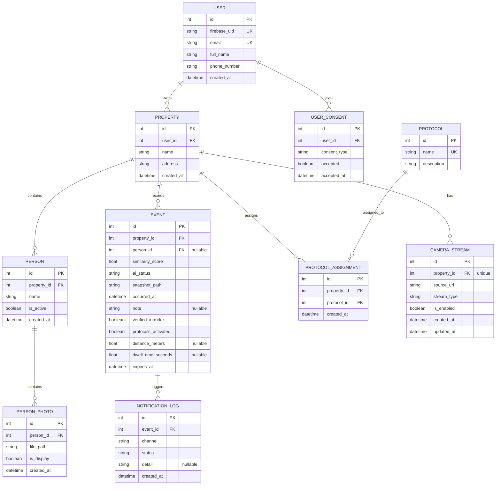

# AI Intruder Backend - Entity Relationship Diagram

## Mermaid ERD

## Table Summary

| Table | Purpose | Key Relationships |
|-------|---------|-------------------|
| **users** | User accounts via Firebase | Parent to properties, user_consents |
| **user_consents** | Privacy/consent tracking | Child of users |
| **properties** | Protected locations | Parent to persons, events, protocols, camera streams |
| **persons** | Known people for facial recognition | Child of properties; parent to person_photos |
| **person_photos** | Reference photos for recognition | Child of persons; is_display flag marks primary photo |
| **protocols** | Response procedures (e.g., "Call Police") | Parent to protocol_assignments |
| **protocol_assignments** | Which protocols apply to which properties | Junction table: properties ↔ protocols |
| **events** | AI detection events (authorized/intruder/human_review) | Child of properties; parent to notification_logs; optional person_id |
| **notification_logs** | Tracking of all notifications sent | Child of events |
| **camera_streams** | Live camera feed configuration | One-to-one with properties |

## Key Design Notes

1. **Users & Properties**: Multi-tenant architecture - one user can own multiple properties
2. **Persons & Recognition**: Known persons have reference photos marked with `is_display=true` for primary display
3. **Events & Status**: AI events tracked with:
   - `ai_status`: AUTHORIZED | INTRUDER | HUMAN_REVIEW (from similarity score)
   - `verified_intruder`: Boolean flag for manual confirmation
   - `protocols_activated`: Whether response protocols were triggered
   - `expires_at`: Automatically set to 72 hours after `occurred_at`
4. **Protocols**: Response procedures assigned per property (e.g., "sound alarm", "call police")
5. **Notifications**: Tracked per event via channel (PUSH, EMAIL, SMS) and status (SENT, FAILED)
6. **Camera Streams**: One per property; supports HTTP proxy, external HLS, or WebRTC

## Cascade Rules

- **User → Property, UserConsent**: CASCADE DELETE
- **Property → Person, Event, ProtocolAssignment, CameraStream**: CASCADE DELETE
- **Person → PersonPhoto**: CASCADE DELETE
- **Event → NotificationLog**: CASCADE DELETE
- **Event.person_id**: SET NULL (orphaned events if person deleted)
- **Protocol → ProtocolAssignment**: CASCADE DELETE
